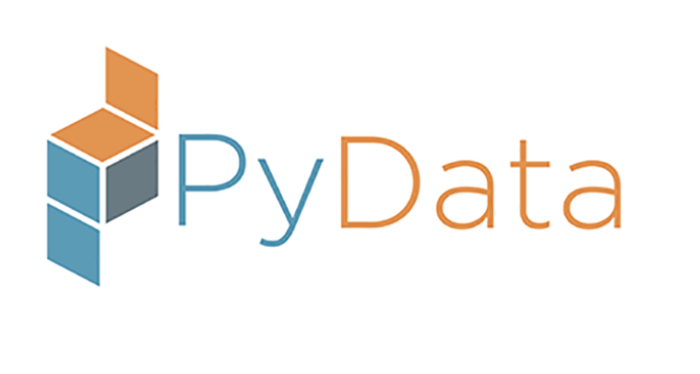

# PyData  

PyData is an educational program of NumFOCUS, a 501(c)(3) nonprofit charity in the United States. Through the combined efforts of NumFOCUS staff and the PyData community, we have created a strong brand recognized for events that:
 
- Deliver valuable content from excellent speakers and presenters
- Serve the community through a strong organized network
- Provide beneficial sponsorship opportunities
- Give attendees a place to share and exchange knowledge, as well as to network with others in the field of data science
- Uphold the high standards of conduct and conference diversity held by NumFOCUS

